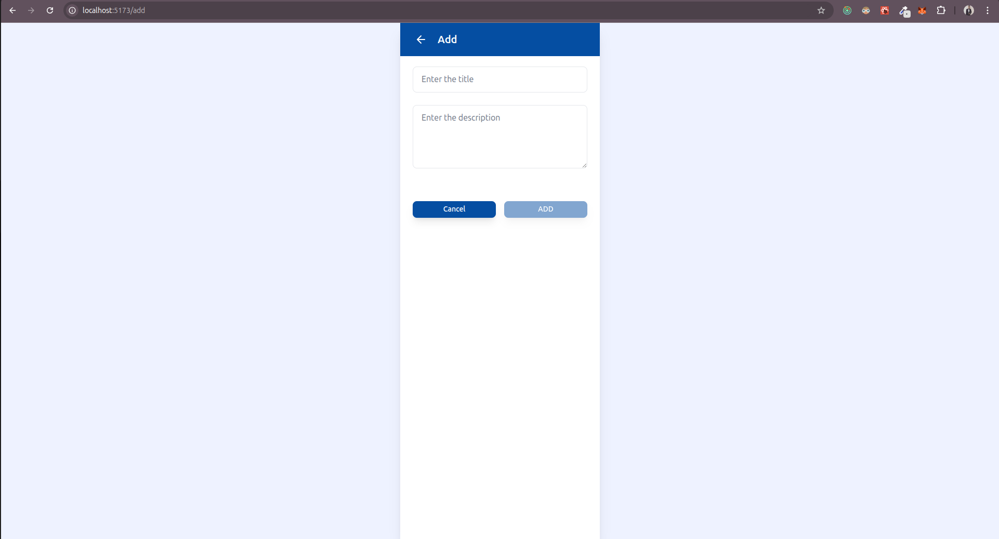
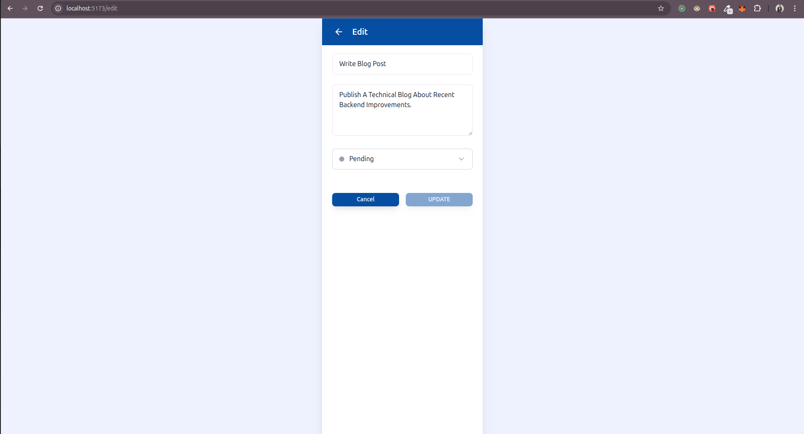
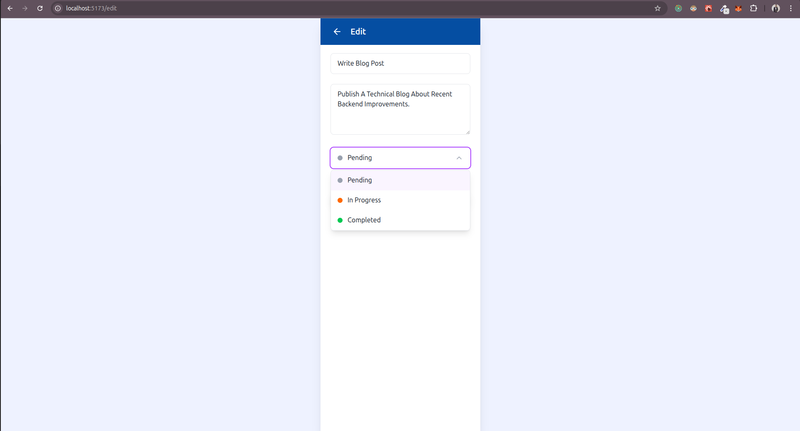
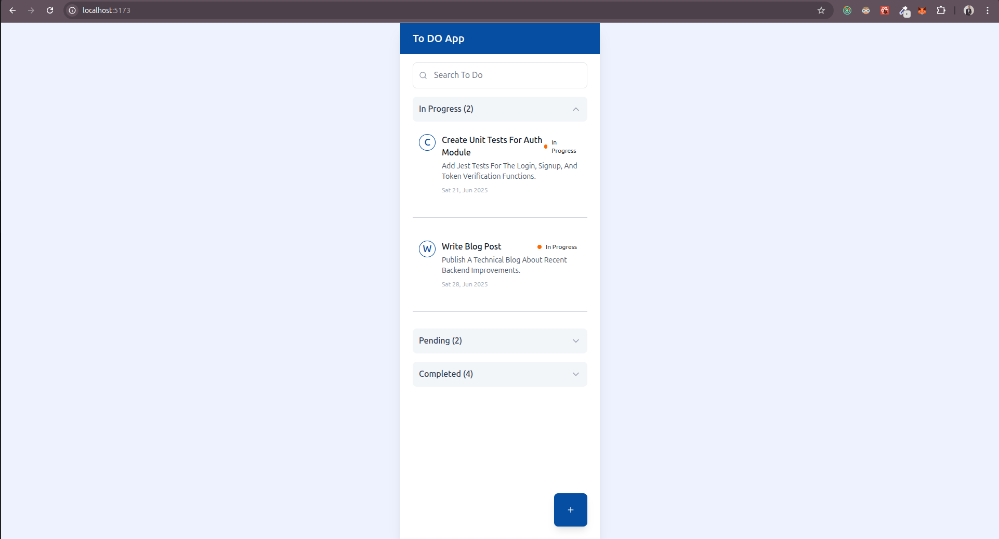

# 📝 TypeScript Task Managment App

A minimal yet structured Task Managment application built using **React**, **Redux Toolkit**, and **TypeScript**. It supports task management features like adding, editing, deleting, and categorizing tasks by status.

---

## 🚀 Getting Started

### 1. Clone the repository

```bash
git clone https://github.com/Farhan817/Tresata_Task_Manager.git
cd Tresata_Task_Manager
```

### 2. Install dependencies

```bash
npm install
# or
yarn install
```

### 3.Start the development server

```bash
npm run dev
# or
yarn dev

```

App will be available at http://localhost:5173 (for Vite).

### 4 Tech Stack

- React (with TSX and hooks)
- Redux Persist (For Storing the redux data in localStorage)
- Redux Toolkit – Global state management
- TypeScript – Type safety and better dev experience
- Formik + Yup – Form handling and validation
- Tailwind CSS – Utility-first styling
- Day.js – Lightweight date formatting
- Lucide Icons – Clean and consistent icons
- React Router DOM – Routing between views

### ScreenShots






